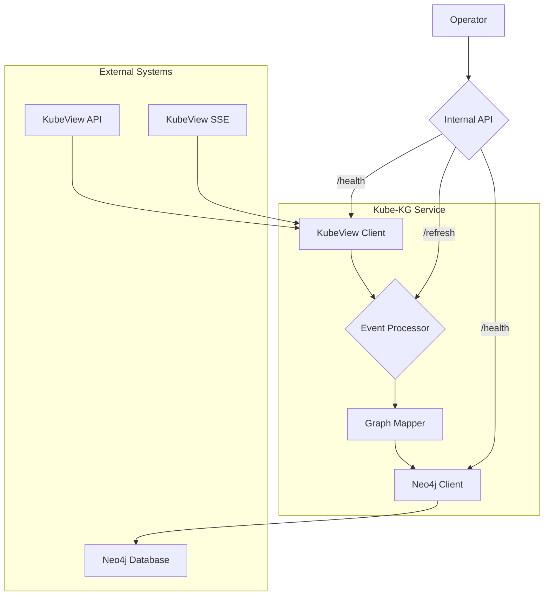
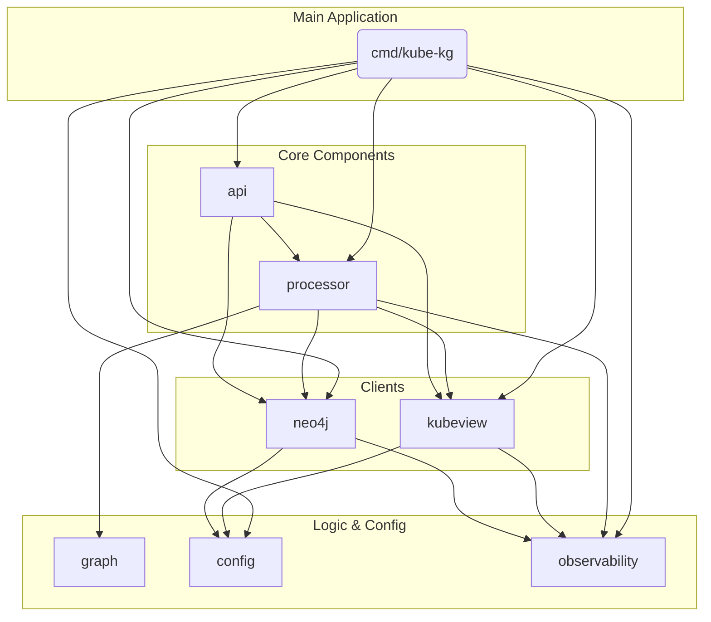
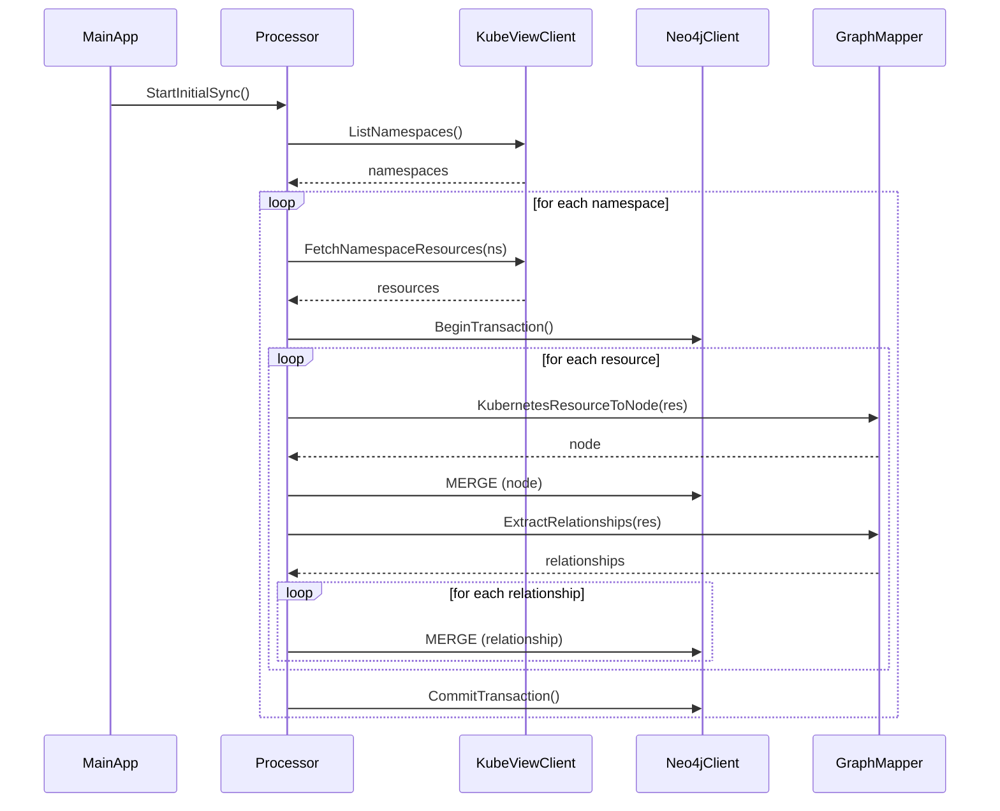
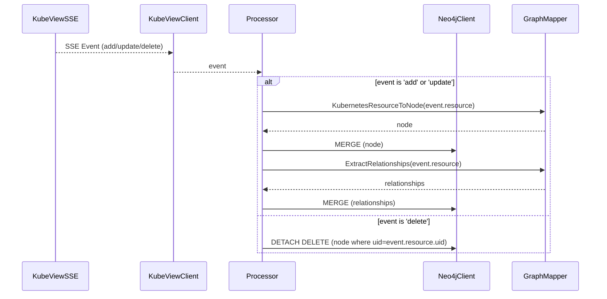

# Kube Knowledge Graph (Kube-KG) Architecture Document

## 1. Introduction

This document outlines the overall project architecture for Kube-KG, including backend systems, shared services, and non-UI specific concerns. Its primary goal is to serve as the guiding architectural blueprint for AI-driven development, ensuring consistency and adherence to chosen patterns and technologies.

**Relationship to Frontend Architecture:**
If the project includes a significant user interface, a separate Frontend Architecture Document will detail the frontend-specific design and MUST be used in conjunction with this document. Core technology stack choices documented herein (see "Tech Stack") are definitive for the entire project, including any frontend components.

### 1.1. Change Log

| Date       | Version | Description                        | Author  |
|:-----------|:--------|:-----------------------------------|:--------|
| 2025-09-17 | 1.0     | Initial draft of the architecture. | Winston |
| 2025-09-18 | 1.1     | Minor updates.                     | Sean    |

### 1.2. Starter Template or Existing Project
Based on the review of the `prd.md`, there is no mention of a specific starter template or an existing codebase. The PRD specifies that the service will be a standalone Go application built from scratch, implying a greenfield development approach. Therefore, the architecture will be designed from the ground up.

## 2. High Level Architecture

### 2.1. Technical Summary

The system is a standalone Go service designed as a data pipeline. It follows an event-driven architecture to process real-time updates from a KubeView API. The core components are a KubeView client for data ingestion, a mapping service to transform Kubernetes resources into a graph model, and a Neo4j client for data persistence. The primary architectural pattern is a consumer-producer model, where the service consumes events from KubeView and produces a knowledge graph in Neo4j. This architecture directly supports the PRD's goal of creating a real-time, queryable representation of a Kubernetes cluster.

### 2.2. High Level Overview

The architecture is a **Standalone Service (Monolith)** as specified in the PRD. The service will be contained within a **Monorepo** for simplified dependency management. The primary data flow begins with an initial data synchronization from the KubeView REST API. Following the initial sync, the service maintains a persistent connection to the KubeView Server-Sent Events (SSE) endpoint to receive real-time updates. Each incoming event (`add`, `update`, `delete`) is processed, mapped to the graph model, and then persisted to the Neo4j database.

### 2.3. High Level Project Diagram



### 2.4. Architectural and Design Patterns

*   **Event-Driven Architecture:** The service is fundamentally event-driven, reacting to changes in the Kubernetes cluster as streamed by KubeView. This is the most efficient way to maintain a real-time graph.
*   **Repository Pattern:** A `Neo4jClient` will be implemented to abstract the data access logic. This will make the service more testable and will decouple the business logic from the database implementation.
*   **Singleton:** The `KubeviewClient` and `Neo4jClient` will be managed as singletons throughout the application lifecycle to ensure efficient connection management.
*   **Observer Pattern:** The SSE client will act as an observable, pushing events to the event processor (the observer).

## 3. Tech Stack

### 3.1. Cloud Infrastructure

-   **Provider:** Cloud Agnostic
-   **Key Services:** The service is designed to run in any Kubernetes environment.
-   **Deployment Regions:** Not Applicable

### 3.2. Technology Stack Table

| Category | Technology | Version | Purpose | Rationale |
| :--- | :--- |:--------| :--- | :--- |
| **Language** | Go | 1.24.6  | Primary development language | Required by PRD. Strong performance and concurrency. |
| **Database** | Neo4j | 5.x     | Graph Database | Required by PRD for storing the knowledge graph. |
| **API** | net/http | 1.24.6  | Internal REST API | Standard library, sufficient for the simple internal API. |
| **Observability** | OpenTelemetry | 1.24.6  | Tracing and Metrics | Required by PRD. Vendor-agnostic observability. |
| **DB Driver** | neo4j-go-driver | 5.15.0  | Neo4j Database Driver | Official and recommended driver for Go. |
| **SSE Client** | r3labs/sse/v2 | 2.0.2   | Server-Sent Events Client | Well-regarded library for SSE, simplifies client implementation. |

## 4. Data Models

### 4.1. KubernetesResource Node

**Purpose:** To represent any Kubernetes resource within the graph.

**Key Attributes:**
-   `uid`: `string` - The unique ID of the Kubernetes resource. This will be the primary key for the node.
-   `kind`: `string` - The type of the resource (e.g., 'Pod', 'Service', 'Deployment'). This will be used as the node's label in Neo4j.
-   `name`: `string` - The name of the resource.
-   `namespace`: `string` - The namespace the resource belongs to.
-   `properties`: `map<string, any>` - A map containing all other metadata from the Kubernetes resource object.

**Relationships:**
-   **`OWNS`**: A relationship from a parent resource to a child resource. This is derived from the `ownerReferences` field in a Kubernetes resource. For example, a `ReplicaSet` node would have an `OWNS` relationship to a `Pod` node.
-   **`SELECTS`**: A relationship from a `Service` to a `Pod`. This is derived from the `selector` field in a `Service` and the labels on a `Pod`.
-   **`MOUNTS`**: A relationship from a `Pod` to a `ConfigMap` or `Secret`. This is derived from the `volumes` and `volumeMounts` fields in a `Pod` specification.

## 5. Components

### 5.1. `config`

**Responsibility:** Load and provide access to application configuration from environment variables.

**Key Interfaces:**
-   `LoadConfig() (*Config, error)`
-   `Config` struct

**Dependencies:** None

**Technology Stack:** Go standard library

### 5.2. `observability`

**Responsibility:** Initialize and configure OpenTelemetry for tracing and metrics.

**Key Interfaces:**
-   `InitTracer() (*sdktrace.TracerProvider, error)`
-   `InitMeter() (*sdkmetric.MeterProvider, error)`

**Dependencies:** `config`

**Technology Stack:** OpenTelemetry Go SDK

### 5.3. `kubeview`

**Responsibility:** Act as the client for the KubeView API and SSE stream.

**Key Interfaces:**
-   `NewKubeviewClient(config) *KubeviewClient`
-   `ListNamespaces() ([]Namespace, error)`
-   `FetchNamespaceResources(namespace) (*Resources, error)`
-   `StreamUpdates(ctx, clientID) (<-chan Event, error)`

**Dependencies:** `config`, `observability`

**Technology Stack:** Go `net/http`, `r3labs/sse/v2`

### 5.4. `neo4j`

**Responsibility:** Manage the connection to and interaction with the Neo4j database.

**Key Interfaces:**
-   `NewNeo4jClient(config) (*Neo4jClient, error)`
-   `RunCypher(query, params) error`
-   `Close()`

**Dependencies:** `config`, `observability`

**Technology Stack:** `neo4j-go-driver`

### 5.5. `graph`

**Responsibility:** Contain the pure logic for mapping Kubernetes resources to graph nodes and relationships.

**Key Interfaces:**
-   `KubernetesResourceToNode(resource) *Node`
-   `ExtractRelationships(resource) []Relationship`

**Dependencies:** None

**Technology Stack:** Go standard library

### 5.6. `processor`

**Responsibility:** Orchestrate the initial sync and the processing of real-time events.

**Key Interfaces:**
-   `InitialSync(kubeviewClient, neo4jClient)`
-   `StartEventProcessor(eventChan, neo4jClient)`

**Dependencies:** `kubeview`, `neo4j`, `graph`, `observability`

**Technology Stack:** Go standard library

### 5.7. `api`

**Responsibility:** Expose the internal `/health` and `/refresh` REST endpoints.

**Key Interfaces:**
-   `NewServer(processor, kubeviewClient, neo4jClient) *http.Server`
-   `HealthHandler(w, r)`
-   `RefreshHandler(w, r)`

**Dependencies:** `processor`, `kubeview`, `neo4j`

**Technology Stack:** Go `net/http`

### 5.8. `cmd/kube-kg`

**Responsibility:** The main application entrypoint. Initializes and starts all other components.

**Key Interfaces:**
-   `main()`

**Dependencies:** All other components

**Technology Stack:** Go standard library

### 5.9. Component Diagram



## 6. Core Workflows

### 6.1. Initial Synchronization Workflow

This diagram illustrates the process of performing a full synchronization of the Kubernetes cluster state when the service starts or when a manual refresh is triggered.



### 6.2. Real-Time Event Processing Workflow

This diagram illustrates how the service processes a single real-time event from the KubeView SSE stream.



## 7. REST API Spec

```yaml
openapi: 3.0.0
info:
  title: Kube-KG Internal API
  version: 1.0.0
  description: An internal API for the Kube-KG service to report health and trigger data refreshes.
servers:
  - url: http://localhost:8080
    description: Local development server

paths:
  /health:
    get:
      summary: Health Check
      description: Reports the health of the service and its dependencies.
      responses:
        '200':
          description: Service is healthy.
          content:
            application/json:
              schema:
                type: object
                properties:
                  status:
                    type: string
                    example: "OK"
                  dependencies:
                    type: object
                    properties:
                      kubeview:
                        type: string
                        example: "OK"
                      neo4j:
                        type: string
                        example: "OK"
        '503':
          description: Service is unhealthy.
          content:
            application/json:
              schema:
                type: object
                properties:
                  status:
                    type: string
                    example: "Unavailable"
                  dependencies:
                    type: object
                    properties:
                      kubeview:
                        type: string
                        example: "Unavailable"
                      neo4j:
                        type: string
                        example: "OK"

  /refresh:
    post:
      summary: Trigger Refresh
      description: Triggers a full re-synchronization of the knowledge graph from KubeView.
      responses:
        '222':
          description: Refresh process has been accepted and started in the background.
          content:
            application/json:
              schema:
                type: object
                properties:
                  status:
                    type: string
                    example: "Refresh triggered"

```

## 8. Database Schema
This section is intentionally left blank as the data model is flexible and does not require a rigid schema. The nodes and relationships are defined in the "Data Models" section.

## 9. Source Tree

```plaintext
kube-kg/
├── cmd/
│   └── kube-kg/
│       └── main.go
├── internal/
│   ├── api/
│   │   └── server.go
│   ├── config/
│   │   └── config.go
│   ├── graph/
│   │   └── mapper.go
│   ├── kubeview/
│   │   └── client.go
│   ├── neo4j/
│   │   └── client.go
│   ├── observability/
│   │   └── telemetry.go
│   └── processor/
│       └── processor.go
├── go.mod
├── go.sum
├── Dockerfile
└── README.md
```

## 10. Infrastructure and Deployment

### 10.1. Infrastructure as Code

-   **Tool:** Docker & Kubernetes Manifests
-   **Location:** `Dockerfile` in the root, Kubernetes manifests in a `/deploy` directory.
-   **Approach:** The service will be packaged as a Docker container. Standard Kubernetes YAML files (Deployment, Service, ConfigMap, Secret) will be used to define how the service is deployed and configured within a cluster.

### 10.2. Deployment Strategy

-   **Strategy:** Rolling Update
-   **CI/CD Platform:** GitHub Actions (recommended)
-   **Pipeline Configuration:** `.github/workflows/ci-cd.yml`

### 10.3. Environments

-   **development:** For local development, connecting to local or development instances of KubeView and Neo4j.
-   **staging:** A pre-production environment that mirrors production as closely as possible. Used for integration testing and validation.
-   **production:** The live environment serving end-users.

### 10.4. Environment Promotion Flow

```
[Local Development] -> [Git Push] -> [CI/CD Pipeline] -> [Staging Environment] -> [Manual Approval] -> [Production Environment]
```

### 10.5. Rollback Strategy

-   **Primary Method:** Re-deploying the previously tagged stable container image.
-   **Trigger Conditions:** Critical bug discovery, high error rates, negative performance impact.
-   **Recovery Time Objective:** < 15 minutes

## 11. Error Handling Strategy

### 11.1. General Approach

-   **Error Model:** Standard Go `error` interface. Custom error types will be created to wrap standard errors with additional context (e.g., `ErrKubeViewConnection`, `ErrNeo4jTransaction`).
-   **Exception Hierarchy:** Not applicable in Go. Errors are returned as values.
-   **Error Propagation:** Errors will be wrapped with context at each layer of the call stack using `fmt.Errorf("context: %w", err)`. This provides a full error trace.

### 11.2. Logging Standards

-   **Library:** `slog` (Go 1.21+ structured logging)
-   **Format:** JSON
-   **Levels:** `DEBUG`, `INFO`, `WARN`, `ERROR`
-   **Required Context:**
    -   **Correlation ID:** A unique ID (e.g., from an OpenTelemetry trace) will be included in all logs related to a specific operation.
    -   **Service Context:** The component name (e.g., `processor`, `kubeview_client`) will be included.
    -   **User Context:** Not applicable for this service.

### 11.3. Error Handling Patterns

#### External API Errors (KubeView Client)

-   **Retry Policy:** Retry with exponential backoff for connection errors to the KubeView SSE stream.
-   **Circuit Breaker:** Not initially required for this service, but can be added if the KubeView API proves to be unstable.
-   **Timeout Configuration:** A reasonable timeout (e.g., 30 seconds) will be configured on the `http.Client` to prevent indefinite hangs.
-   **Error Translation:** KubeView API errors (e.g., 4xx, 5xx) will be wrapped in custom error types.

#### Business Logic Errors

-   **Custom Exceptions:** Custom error types like `ErrInvalidEvent` or `ErrResourceMappingFailed` will be used.
-   **User-Facing Errors:** Not applicable. Errors will be logged internally.
-   **Error Codes:** Not required for this internal service.

#### Data Consistency (Neo4j Client)

-   **Transaction Strategy:** All write operations for a given unit of work (e.g., processing a single event, syncing a namespace) will be performed within a single Neo4j transaction.
-   **Compensation Logic:** If a transaction fails, it will be rolled back. The operation will be retried if the error is transient.
-   **Idempotency:** All Neo4j write queries will use `MERGE` to ensure that re-processing the same event does not create duplicate data.

## 12. Coding Standards

### 12.1. Core Standards

-   **Languages & Runtimes:** Go 1.24.6
-   **Style & Linting:**
    -   `gofmt` will be used to format all Go code.
    -   `golangci-lint` will be used for static analysis with the default set of linters.
    -   Lines should be no longer than 120 characters
-   **Test Organization:** Test files will be named `_test.go` and will be located in the same package as the code they are testing.

### 12.2. Naming Conventions

-   Standard Go naming conventions will be followed (e.g., `PascalCase` for exported identifiers, `camelCase` for unexported identifiers).

### 12.3. Critical Rules

-   **No `init()` functions:** The `init()` function is forbidden. All initialization should be done explicitly in the `main()` function or in component constructors.
-   **No global variables:** Global variables are forbidden. All state should be managed within structs and passed as dependencies.
-   **Use `slog` for all logging:** The `log` package is forbidden. All logging must be done through the configured `slog` logger.
-   **Errors must be wrapped:** All errors returned from external libraries or other components must be wrapped with context.
-   **Use `context.Context`:** The `context.Context` must be passed as the first argument to all functions that perform I/O or interact with external systems.

## 13. Test Strategy and Standards

### 13.1. Testing Philosophy

-   **Approach:** Test-After. Tests will be written after the implementation of a feature.
-   **Coverage Goals:** A target of 80% unit test coverage will be enforced.
-   **Test Pyramid:** The testing strategy will follow the testing pyramid: a large number of unit tests, a smaller number of integration tests, and a minimal set of end-to-end tests.

### 13.2. Test Types and Organization

#### Unit Tests

-   **Framework:** Go `testing` package
-   **File Convention:** `_test.go`
-   **Location:** In the same package as the code being tested.
-   **Mocking Library:** `gomock`
-   **Coverage Requirement:** 80%

**AI Agent Requirements:**
-   Generate tests for all public methods.
-   Cover edge cases and error conditions.
-   Follow AAA pattern (Arrange, Act, Assert).
-   Mock all external dependencies.

#### Integration Tests

-   **Scope:** Test the interaction between the service and its external dependencies (KubeView, Neo4j).
-   **Location:** In a separate package with a `_test` suffix (e.g., `processor_test`).
-   **Test Infrastructure:**
    -   **KubeView:** A mock KubeView server will be used to serve static JSON and SSE data.
    -   **Neo4j:** Testcontainers will be used to spin up a real Neo4j database in a Docker container for each test run.

#### End-to-End Tests

-   **Framework:** Manual test plan documented in the `README.md`.
-   **Scope:** Test the entire service from end to end, from the KubeView API to the Neo4j database.
-   **Environment:** A dedicated `staging` environment.
-   **Test Data:** A pre-defined set of Kubernetes manifests will be applied to the `staging` cluster to create a known state for testing.

### 13.3. Test Data Management

-   **Strategy:** Test data will be stored in a `/testdata` directory.
-   **Fixtures:** JSON files will be used as fixtures for mock KubeView API responses.
-   **Factories:** Not required for this project.
-   **Cleanup:** The Testcontainers library will automatically clean up the Neo4j database after each integration test run.

### 13.4. Continuous Testing

-   **CI Integration:** All unit and integration tests will be run on every push to the repository using GitHub Actions.
-   **Performance Tests:** Not in scope for the initial version.
-   **Security Tests:** Not in scope for the initial version.

## 14. Security

### 14.1. Input Validation

-   **Validation Library:** Go standard library (`encoding/json` for struct unmarshalling).
-   **Validation Location:** In the `kubeview` client, immediately after receiving data from the KubeView API or SSE stream.
-   **Required Rules:**
    -   All incoming data from KubeView must be successfully unmarshalled into the defined Go structs.
    -   Any unmarshalling errors must be logged, and the invalid data must be discarded.

### 14.2. Authentication & Authorization

-   **Auth Method:** The internal API (`/health`, `/refresh`) does not require authentication as it is not exposed outside the cluster. If this changes, token-based authentication (e.g., JWT) should be implemented.
-   **Session Management:** Not applicable.
-   **Required Patterns:**
    -   The service must use credentials (e.g., API key, username/password) to connect to the KubeView and Neo4j services. These credentials must be managed as secrets.

### 14.3. Secrets Management

-   **Development:** Use a `.env` file (which must be in `.gitignore`) to load secrets into environment variables.
-   **Production:** Use Kubernetes Secrets to mount secrets as environment variables into the running container.
-   **Code Requirements:**
    -   NEVER hardcode secrets in the source code.
    -   Access secrets only via the `config` component.
    -   NEVER log secrets or any personally identifiable information (PII).

### 14.4. API Security

-   **Rate Limiting:** Not required for the internal API.
-   **CORS Policy:** Not applicable as the API is not a public web API.
-   **Security Headers:** Not required for the internal API.
-   **HTTPS Enforcement:** The internal API will run on plain HTTP. TLS termination should be handled by the Kubernetes ingress controller or a service mesh if the API is ever exposed.

### 14.5. Data Protection

-   **Encryption at Rest:** The Neo4j database must be configured to encrypt data at rest.
-   **Encryption in Transit:** The connections to KubeView and Neo4j must use TLS.
-   **PII Handling:** The service handles Kubernetes metadata, which can be sensitive. Access to the Neo4j database must be strictly controlled.
-   **Logging Restrictions:** Do not log the full body of Kubernetes resource objects. Only log metadata like the resource `uid`, `kind`, `name`, and `namespace`.

### 14.6. Dependency Security

-   **Scanning Tool:** `govulncheck` and `trivy fs`.  `trivy image` should be used to scan the docker image.
-   **Update Policy:** Dependencies will be reviewed and updated on a regular basis.
-   **Approval Process:** New dependencies must be approved by the project lead.

### 14.7. Security Testing

-   **SAST Tool:** `gosec` will be integrated into the CI/CD pipeline to perform static analysis security testing.
-   **DAST Tool:** Not in scope for this internal service.
-   **Penetration Testing:** Not in scope for this internal service.
