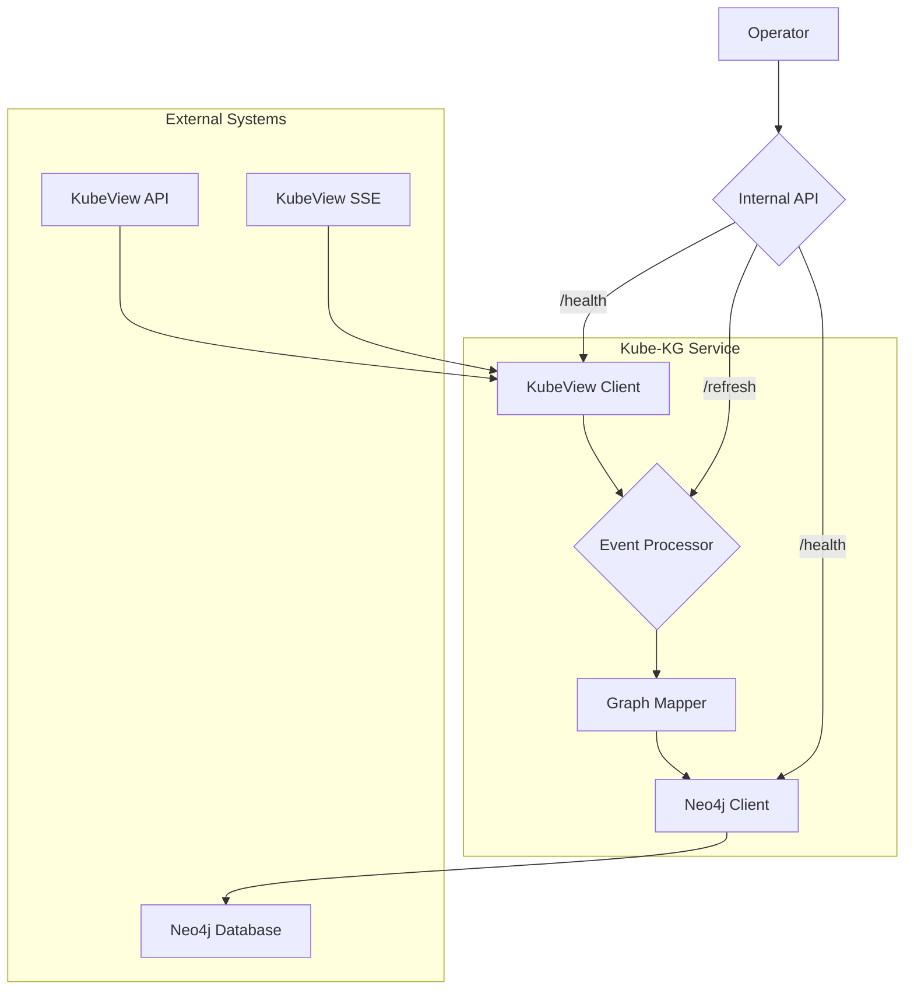

## 2. High Level Architecture

### 2.1. Technical Summary

The system is a standalone Go service designed as a data pipeline. It follows an event-driven architecture to process real-time updates from a KubeView API. The core components are a KubeView client for data ingestion, a mapping service to transform Kubernetes resources into a graph model, and a Neo4j client for data persistence. The primary architectural pattern is a consumer-producer model, where the service consumes events from KubeView and produces a knowledge graph in Neo4j. This architecture directly supports the PRD's goal of creating a real-time, queryable representation of a Kubernetes cluster.

### 2.2. High Level Overview

The architecture is a **Standalone Service (Monolith)** as specified in the PRD. The service will be contained within a **Monorepo** for simplified dependency management. The primary data flow begins with an initial data synchronization from the KubeView REST API. Following the initial sync, the service maintains a persistent connection to the KubeView Server-Sent Events (SSE) endpoint to receive real-time updates. Each incoming event (`add`, `update`, `delete`) is processed, mapped to the graph model, and then persisted to the Neo4j database.

### 2.3. High Level Project Diagram

### 2.4. Architectural and Design Patterns

*   **Event-Driven Architecture:** The service is fundamentally event-driven, reacting to changes in the Kubernetes cluster as streamed by KubeView. This is the most efficient way to maintain a real-time graph.
*   **Repository Pattern:** A `Neo4jClient` will be implemented to abstract the data access logic. This will make the service more testable and will decouple the business logic from the database implementation.
*   **Singleton:** The `KubeviewClient` and `Neo4jClient` will be managed as singletons throughout the application lifecycle to ensure efficient connection management.
*   **Observer Pattern:** The SSE client will act as an observable, pushing events to the event processor (the observer).
