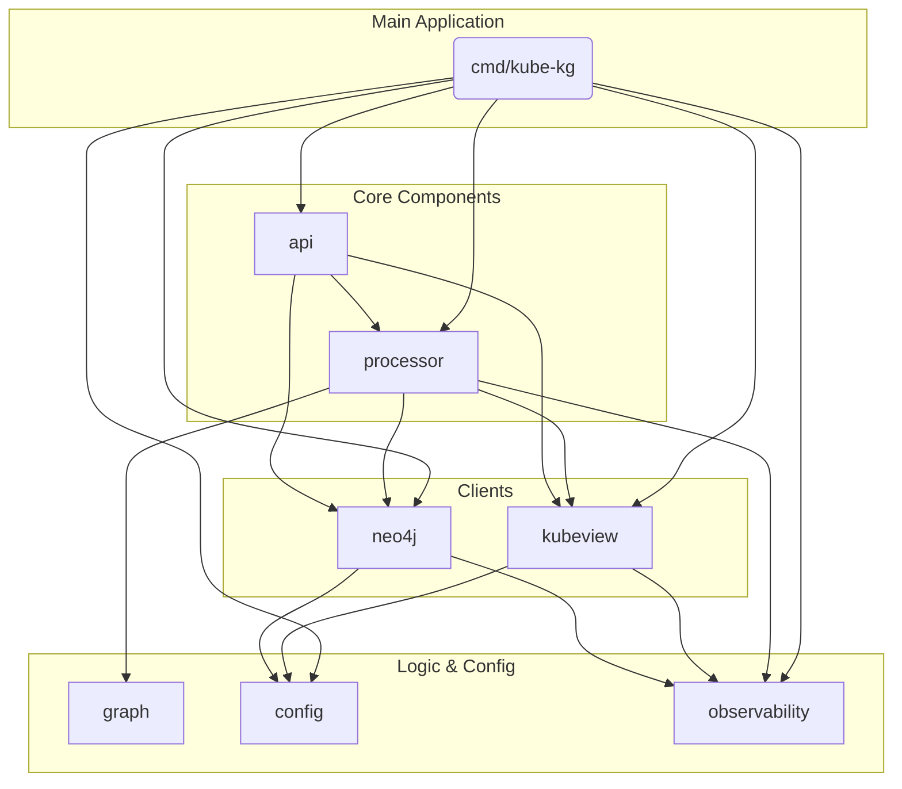

## 5. Components

### 5.1. `config`

**Responsibility:** Load and provide access to application configuration from environment variables.

**Key Interfaces:**
-   `LoadConfig() (*Config, error)`
-   `Config` struct

**Dependencies:** None

**Technology Stack:** Go standard library

### 5.2. `observability`

**Responsibility:** Initialize and configure OpenTelemetry for tracing and metrics.

**Key Interfaces:**
-   `InitTracer() (*sdktrace.TracerProvider, error)`
-   `InitMeter() (*sdkmetric.MeterProvider, error)`

**Dependencies:** `config`

**Technology Stack:** OpenTelemetry Go SDK

### 5.3. `kubeview`

**Responsibility:** Act as the client for the KubeView API and SSE stream.

**Key Interfaces:**
-   `NewKubeviewClient(config) *KubeviewClient`
-   `ListNamespaces() ([]Namespace, error)`
-   `FetchNamespaceResources(namespace) (*Resources, error)`
-   `StreamUpdates(ctx, clientID) (<-chan Event, error)`

**Dependencies:** `config`, `observability`

**Technology Stack:** Go `net/http`, `r3labs/sse/v2`

### 5.4. `neo4j`

**Responsibility:** Manage the connection to and interaction with the Neo4j database.

**Key Interfaces:**
-   `NewNeo4jClient(config) (*Neo4jClient, error)`
-   `RunCypher(query, params) error`
-   `Close()`

**Dependencies:** `config`, `observability`

**Technology Stack:** `neo4j-go-driver`

### 5.5. `graph`

**Responsibility:** Contain the pure logic for mapping Kubernetes resources to graph nodes and relationships.

**Key Interfaces:**
-   `KubernetesResourceToNode(resource) *Node`
-   `ExtractRelationships(resource) []Relationship`

**Dependencies:** None

**Technology Stack:** Go standard library

### 5.6. `processor`

**Responsibility:** Orchestrate the initial sync and the processing of real-time events.

**Key Interfaces:**
-   `InitialSync(kubeviewClient, neo4jClient)`
-   `StartEventProcessor(eventChan, neo4jClient)`

**Dependencies:** `kubeview`, `neo4j`, `graph`, `observability`

**Technology Stack:** Go standard library

### 5.7. `api`

**Responsibility:** Expose the internal `/health` and `/refresh` REST endpoints.

**Key Interfaces:**
-   `NewServer(processor, kubeviewClient, neo4jClient) *http.Server`
-   `HealthHandler(w, r)`
-   `RefreshHandler(w, r)`

**Dependencies:** `processor`, `kubeview`, `neo4j`

**Technology Stack:** Go `net/http`

### 5.8. `cmd/kube-kg`

**Responsibility:** The main application entrypoint. Initializes and starts all other components.

**Key Interfaces:**
-   `main()`

**Dependencies:** All other components

**Technology Stack:** Go standard library

### 5.9. Component Diagram

