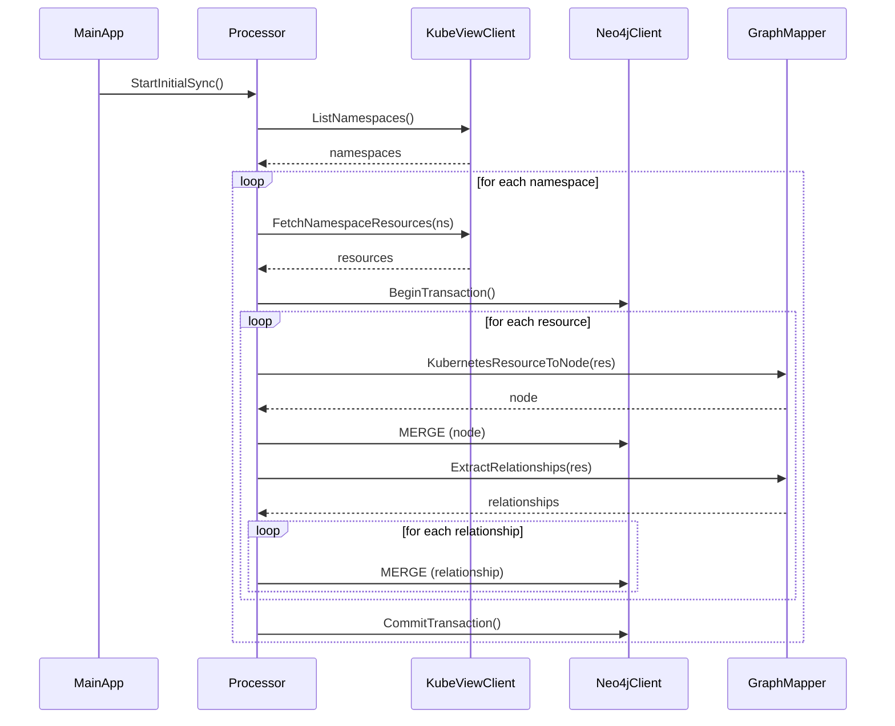
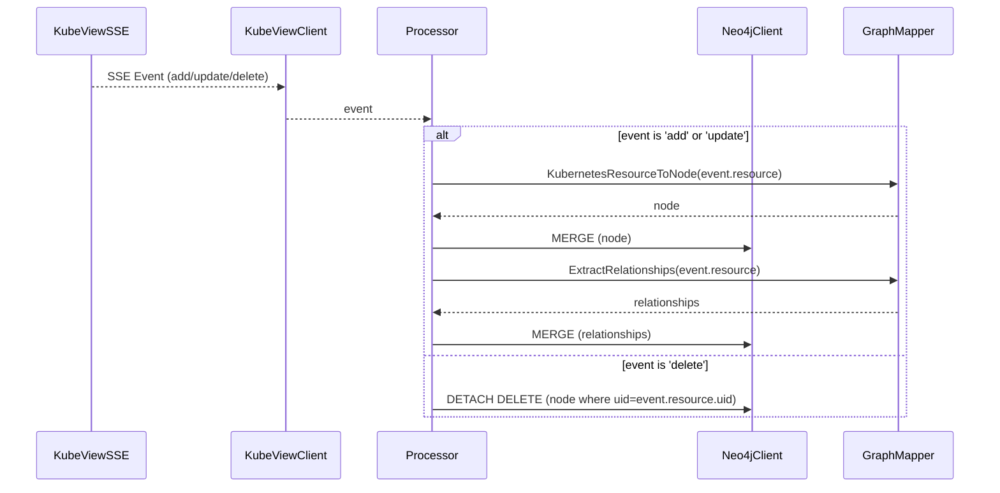

## 6. Core Workflows

### 6.1. Initial Synchronization Workflow

This diagram illustrates the process of performing a full synchronization of the Kubernetes cluster state when the service starts or when a manual refresh is triggered.

### 6.2. Real-Time Event Processing Workflow

This diagram illustrates how the service processes a single real-time event from the KubeView SSE stream.

